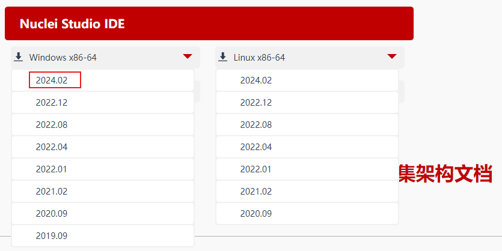
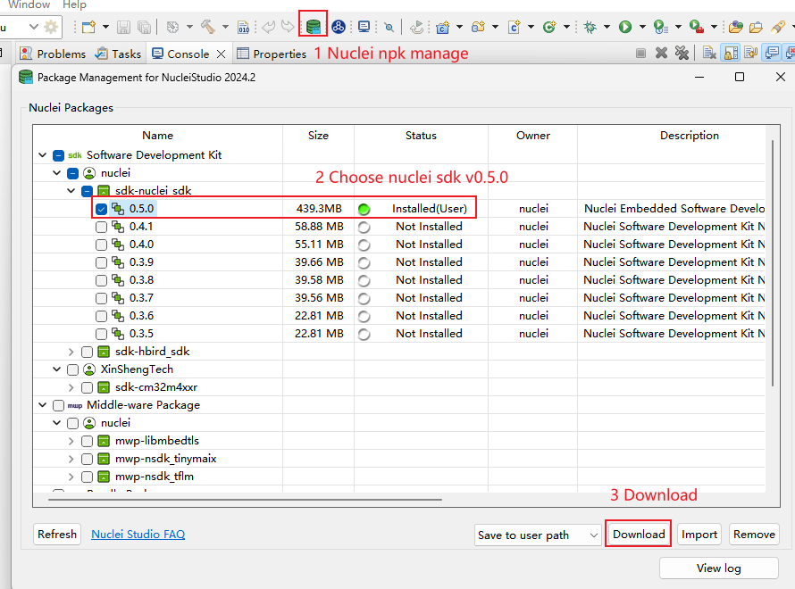
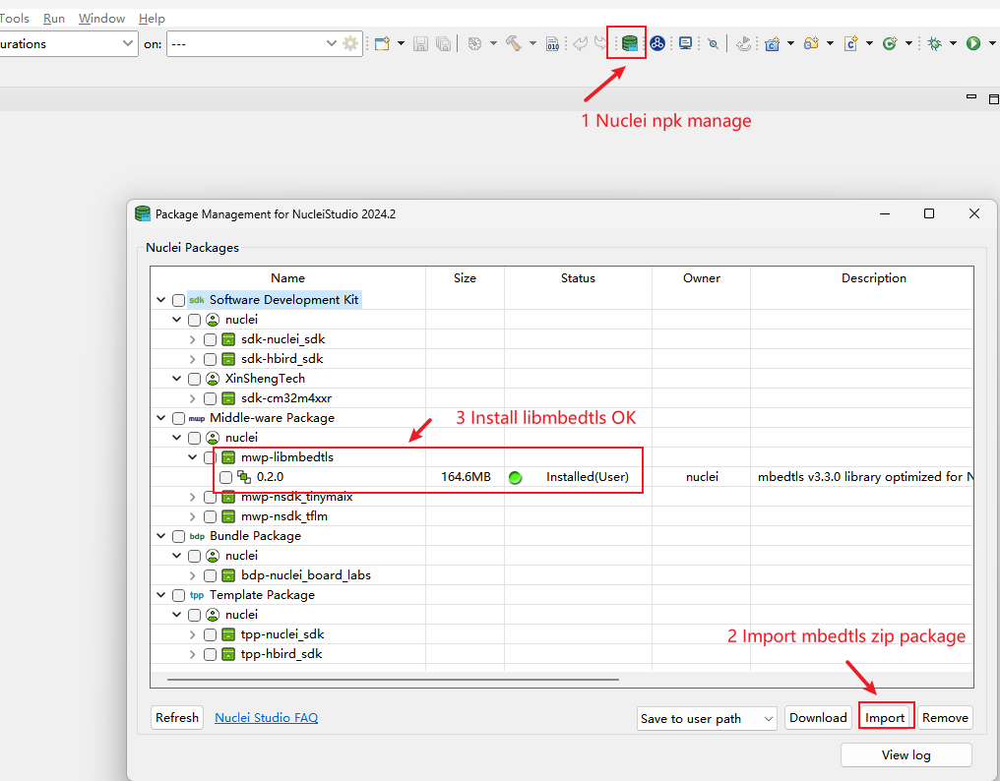
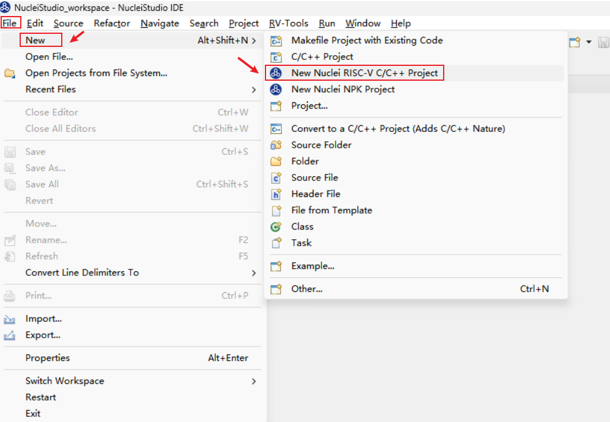
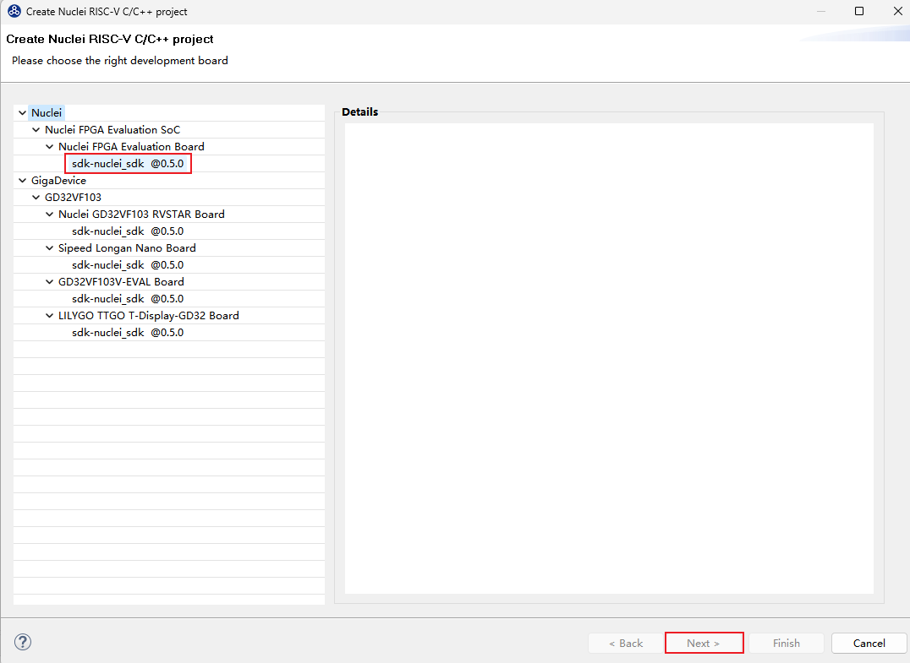
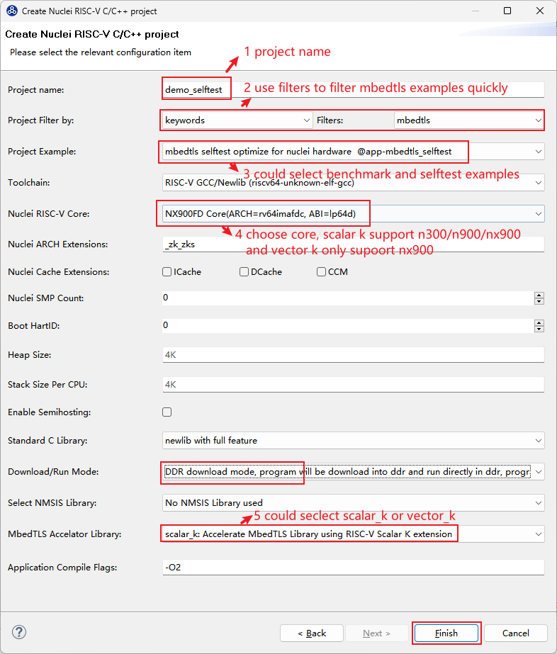
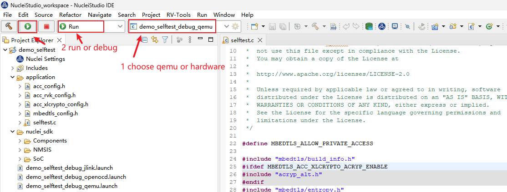
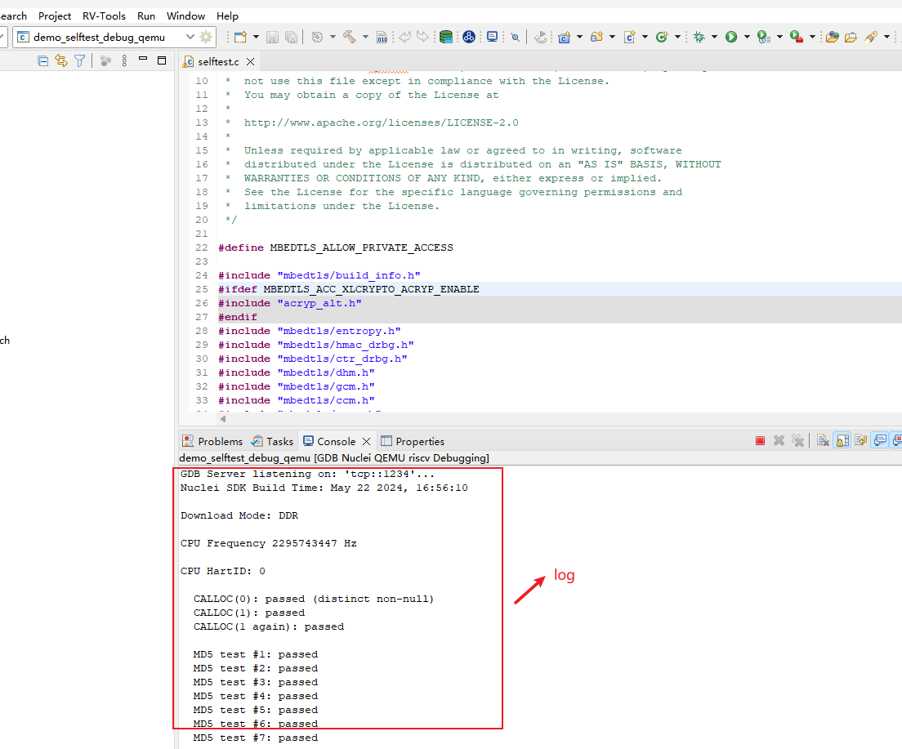
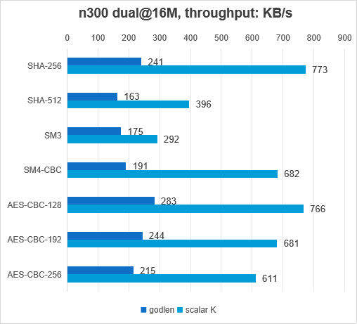
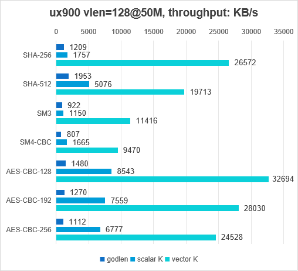

# MbedTLS Optimized using RISC-V K extension

## Introduction of Mbed TLS

Mbed TLS is a C library that implements cryptographic primitives, X.509 certificate manipulation and the SSL/TLS and DTLS protocols. Its small code footprint makes it suitable for embedded systems.

## Introduction of Nuclei RISC-V K extension

**RISC-V K extensions：** include scalar and vector cryptographic extensions, is used to improve the speed of cryptography algorithms and reduce the size of programs.

**Scalar K:**  using general-purpose X registers, so it is lightweight and suitable for RV32 and RV64
**Vector K:** based on the Vector registers, designed to be highly performant, with large application and server-class cores being the main target

The following crypto algorithms are accelerated：

* AES-128/192/256 GCM/CCM/ECB/OCB/OFB/CFB/CFB1/CFB8/CTR
* AES-128/256-XTS
* SHA-224/SHA-256
* SHA-384/SHA-512
* SM3
* SM4 CBC/ECB/CCM/CFB/CFB1/CFB8/CTR/GCM/OFB/XTS

## Introduction of Nuclei Mbed TLS

The features of Nuclei Mbed TLS are listed below:

- The Nuclei Mbed TLS is used as a **middleware** library called as **libmbedtls**. **libmbedtls** is based on **mbedtls v3.3.0**, supported risc-v K extension feature.

- The library files are as follows: 

~~~console
├── accelerator/scalar_k
│   ├── aes_alt.c
│   ├── api_aes.h
│   ├── api_sm4.h
│   ├── sha256_alt.c
│   ├── sha512_alt.c
│   ├── share
│   ├── sm3_alt.c
│   ├── sm4_alt.c
│   ├── sm4_zscrypto.c
│   ├── zscrypto_rv32
│   └── zscrypto_rv64

~~~

~~~console
├── accelerator/vector_k
│   ├── aes_alt.c
│   ├── aes-macros.S
│   ├── aes-riscv64-zvkned_key.S
│   ├── aes-riscv64-zvkned.S
│   ├── aes-riscv64-zvkned-zvbb-zvkg.S
│   ├── aes-riscv64-zvkned-zvkb.S
│   ├── api_aes.h
│   ├── api_sha256.h
│   ├── api_sha512.h
│   ├── api_sm3.h
│   ├── api_sm4.h
│   ├── sha256_alt.c
│   ├── sha256-riscv64-zvknha_or_zvknhb-zvkb.S
│   ├── sha512_alt.c
│   ├── sha512-riscv64-zvknhb-zvkb.S
│   ├── sm3_alt.c
│   ├── sm3-riscv64-zvksh-zvkb.S
│   ├── sm4_alt.c
│   └── sm4-riscv64-zvksed-zvkb.S
~~~

- Testcaces:

~~~console
├── examples
│   ├── benchmark
│   └── selftest
~~~

- **Note:** the original configuration file `include/mbedtls/mbedtls_config.h` has been moved to `examples/xxx/mbedtls_config.h`. Each example has its own `mbedtls_config.h` so that user can configure it more flexibly.

- Each `examples/xxx/mbedtls_config.h` includes its own `acc_rvk_config.h`. You can enable the  macros in `examples/xxx/acc_rvk_config.h` to enable risc-v K extension in `accelerator/scalar_k/xxx_alt.c` or `accelerator/vector_k/xxx_alt.c`,  disable it thus turning to software implement in `library/xxx.c`. The macros are as follows:

~~~makefile
#define MBEDTLS_AES_SETKEY_ENC_ALT
#define MBEDTLS_AES_SETKEY_DEC_ALT
#define MBEDTLS_AES_ENCRYPT_ALT
#define MBEDTLS_AES_DECRYPT_ALT

#if defined(MBEDTLS_ACC_VECTOR_K)
#define MBEDTLS_AES_CBC_ALT
#endif

#define MBEDTLS_SHA256_PROCESS_ALT
#define MBEDTLS_SHA512_PROCESS_ALT

#if defined(MBEDTLS_ACC_VECTOR_K)
#define MBEDTLS_SHA256_UPDATE_ALT
#define MBEDTLS_SHA512_UPDATE_ALT
#endif

#define MBEDTLS_SM3_PROCESS_ALT

#if defined(MBEDTLS_ACC_VECTOR_K)
#define MBEDTLS_SM3_UPDATE_ALT
#endif

#define MBEDTLS_SM4_SETKEY_ENC_ALT
#define MBEDTLS_SM4_SETKEY_DEC_ALT
#define MBEDTLS_SM4_CRYPT_ECB_ALT
~~~

## How to use libmbedtls in Terminal

1. Get Nuclei SDK (v0.5.0) from https://github.com/Nuclei-Software/nuclei-sdk/releases/tag/0.5.0

2. Get **libmbedtls** zip package from https://github.com/Nuclei-Software/mbedtls , unzip it and copy it to the *Components* of nuclei-sdk.

   ~~~console
   nuclei-sdk$ tree -L 2
   .
   ├── application
   ├── Build
   ├── Components
   │   └── mbedtls  # put it here
   ├── doc
   ├── ideprojects
   ├── LICENSE
   ├── Makefile
   ├── NMSIS
   ├── NMSIS_VERSION
   ├── npk.yml
   ├── OS
   ├── package.json
   ├── README.md
   ├── SConscript
   ├── setup.bat
   ├── setup.ps1
   ├── setup.sh
   ├── SoC
   ├── tags
   ├── test
   ├── Testing
   └── tools
   ~~~

3. Setup Nuclei SDK to configure your toolchains and environment, you can refer to https://doc.nucleisys.com/nuclei_sdk/quickstart.html for details.

4. Build and run application.

   Assume that you will run your application using bitstream, Nuclei NX900 core and ddr download mode.

   ~~~shell
   # risc-v K extensions just support examples/benchmark and examples/selftest
   $ cd Components/mbedtls/examples/benchmark
   
   # Build
   # scalar K support n300 n900 nx900
   # vector K only support nx900 with _zve64x extension
   # MBEDTLS_ACC could be choosen in {scalar_k, vector_k, xlcrypt}, if set MBEDTLS_ACC None, means has no acceleration
   make CORE=nx900 MBEDTLS_ACC=scalar_k DOWNLOAD=ddr all
   # or
   make CORE=nx900 MBEDTLS_ACC=vector_k DOWNLOAD=ddr all
   # or
   make CORE=nx900 MBEDTLS_ACC= DOWNLOAD=ddr all  # no acceleration
   
   # Upload
   # upload to fpga
   make CORE=nx900 DOWNLOAD=ddr upload
   # or qemu, Note: qemu don't support vector_k at this time
   make CORE=nx900 DOWNLOAD=ddr run_qemu
   ~~~
   
   **Note:** if you built with `DOWNLOAD=ilm`, please use 512K ilm/dlm,  **make sure your cpu bitstream configured with 512K ILM/DLM if you want to run on hardware **.
   
   ~~~sh
   # file: /path/to/nuclei_sdk/SoC/evalsoc/Board/nuclei_fpga_eval/Source/GCC/gcc_evalsoc_ilm.ld
   # Partial as follows:
   
   OUTPUT_ARCH( "riscv" )
   
   ENTRY( _start )
   
   MEMORY
   {
     ilm (rxa!w) : ORIGIN = 0x80000000, LENGTH = 512K  /* change 64K to 512K */
     ram (wxa!r) : ORIGIN = 0x90000000, LENGTH = 512K  /* change 64K to 512K */
   }
   ~~~

Here are the logs of *Components/mbedtls/examples/selftest* in NX900 FPGA，DOWNLOAD=ilm:

~~~sh
$ make CORE=nx900 MBEDTLS_ACC=scalar_k DOWNLOAD=ilm all
$ make CORE=nx900 MBEDTLS_ACC=scalar_k DOWNLOAD=ilm upload
~~~

log as follows(with deletion):
~~~log
Nuclei SDK Build Time: May 21 2024, 18:07:24
Download Mode: ILM
CPU Frequency 50322800 Hz
CPU HartID: 0

  SHA-224 test #1: passed
  SHA-224 test #2: passed
  SHA-224 test #3: passed
  SHA-256 test #1: passed
  SHA-256 test #2: passed
  SHA-256 test #3: passed

  SHA-384 test #1: passed
  SHA-384 test #2: passed
  SHA-384 test #3: passed
  SHA-512 test #1: passed
  SHA-512 test #2: passed
  SHA-512 test #3: passed

  SM3 test #1: passed
  SM3 test #2: passed

  SM4-ECB-128 (enc): passed
  SM4-ECB-128 (dec): passed

  SM4-CBC-128 (enc): passed
  SM4-CBC-128 (dec): passed

  SM4-CTR-128 (enc): passed
  SM4-CTR-128 (dec): passed

  AES-ECB-128 (dec): passed
  AES-ECB-128 (enc): passed
  AES-ECB-192 (dec): passed
  AES-ECB-192 (enc): passed
  AES-ECB-256 (dec): passed
  AES-ECB-256 (enc): passed

  AES-CBC-128 (dec): passed
  AES-CBC-128 (enc): passed
  AES-CBC-192 (dec): passed
  AES-CBC-192 (enc): passed
  AES-CBC-256 (dec): passed
  AES-CBC-256 (enc): passed

  AES-CFB128-128 (dec): passed
  AES-CFB128-128 (enc): passed
  AES-CFB128-192 (dec): passed
  AES-CFB128-192 (enc): passed
  AES-CFB128-256 (dec): passed
  AES-CFB128-256 (enc): passed

  AES-OFB-128 (dec): passed
  AES-OFB-128 (enc): passed
  AES-OFB-192 (dec): passed
  AES-OFB-192 (enc): passed
  AES-OFB-256 (dec): passed
  AES-OFB-256 (enc): passed

  AES-CTR-128 (dec): passed
  AES-CTR-128 (enc): passed
  AES-CTR-128 (dec): passed
  AES-CTR-128 (enc): passed
  AES-CTR-128 (dec): passed
  AES-CTR-128 (enc): passed

  AES-GCM-128 #0 (enc): passed
  AES-GCM-128 #0 (dec): passed
  AES-GCM-128 #1 (enc): passed
  AES-GCM-128 #1 (dec): passed
  AES-GCM-128 #2 (enc): passed
  AES-GCM-128 #2 (dec): passed
  AES-GCM-128 #3 (enc): passed
  AES-GCM-128 #3 (dec): passed
  AES-GCM-192 #0 (enc): passed
  AES-GCM-192 #0 (dec): passed
  AES-GCM-192 #1 (enc): passed
  AES-GCM-192 #1 (dec): passed
  AES-GCM-192 #2 (enc): passed
  AES-GCM-192 #2 (dec): passed
  AES-GCM-192 #3 (enc): passed
  AES-GCM-192 #3 (dec): passed
  AES-GCM-256 #0 (enc): passed
  AES-GCM-256 #0 (dec): passed
  AES-GCM-256 #1 (enc): passed
  AES-GCM-256 #1 (dec): passed
  AES-GCM-256 #2 (enc): passed
  AES-GCM-256 #2 (dec): passed
  AES-GCM-256 #3 (enc): passed
  AES-GCM-256 #3 (dec): passed

  CCM-AES #1: passed
  CCM-AES #2: passed
  CCM-AES #3: passed

  Executed 13 test suites

  [ All tests PASS ]
~~~

## How to use libmbedtls in Nuclei Studio IDE

1. Download Nuclei Studio IDE from https://www.nucleisys.com/download.php, please refer to https://www.nucleisys.com/upload/files/doc/nucleistudio/Nuclei_Studio_User_Guide_202402.pdf to get the detailed usage of Nuclei Studio IDE.

   

2. Go to the Nuclei Package Management page to import the zip package of the subsystem SDK until the Status is installed, you need to make sure that only one version of Nuclei SDK is installed.

   

3. Get **libmbedtls** zip package from https://github.com/Nuclei-Software/mbedtls , and import the zip package of **libmbedtls** until the Status is installed:

4. Create a new Nuclei RISC-V C/C++ Project.

   

- Choose the SoC, board and SDK.

   

   

- Use Filters to filter the keyword **mbedtls** to quickly find the example you want to run, and then set the configuration items and click Finish. For example, you want to run **selftest** in ddr download mode, **you can select scalar_k or vector_k or xlcrypto** :

   

5. Build and run application.

* Use nuclei studio, run on qemu:

  

  

**Note:** if you built with `DOWNLOAD=ilm`, please use 512K ilm/dlm,  **make sure your cpu bitstream configured with 512K ILM/DLM if you want to run on hardware **, and modify `nuclei_sdk/SoC/evalsoc/Board/nuclei_fpga_eval/Source/GCC/gcc_evalsoc_ilm.ld`

## Data performance

1. The data performance is obtained by running the benchmark example, please refer to `examples/benchmark/README.md` for specific test items.

2. Data performance is calculated based on the frequency of the CPU and the number of cycles consumed during the execution of the crypto algorithm. Using **KB/s** as the starndard for data performance.

   

   

   
