# MbedTLS Optimized using Nuclei Crypto Engine

## Introduction of Mbed TLS

Mbed TLS is a C library that implements cryptographic primitives, X.509 certificate manipulation and the SSL/TLS and DTLS protocols. Its small code footprint makes it suitable for embedded systems.

## Introduction of Nuclei crypto acceleration engine

The Nuclei crypto acceleration engine includes **HASH**, **CRYP**, **ACRYP** IP.

The hash processor (**HASH**) is a fully compliant implementation of the secure hash algorithm (SHA-1, SHA-224, SHA-256, SHA-384, SHA-512), the MD5 (message-digest algorithm 5) and SM3 hash algorithm and the **HMAC** (keyed-hash message authentication code) algorithm suitable for a variety of applications. **HMAC** is suitable for applications requiring message authentication.

The cryptographic processor (**CRYP**) can be used both to encrypt and decrypt data using the DES, Triple-DES, AES algorithms.

The Nuclei Asymmetric Cryptographic Accelerator (**ACRYP**) provides capability for basic arithmetic and frequently used cryptographic operations like BIGNUM calculation, RSA (key size up to 8192) and ECC curve (Short-Weierstrass curve and Koblitz curve including curves from standard NIST, brainpool, SEC 2 and SM2, Montgomery curve 25519/448, Edwards curve 25519/448).

Please refer to Nuclei crypto IP document for details.

## Introduction of Nuclei Mbed TLS

The features of Nuclei Mbed TLS are listed below:

- The Nuclei Mbed TLS is used as a **middleware** library called as **libmbedtls**. **libmbedtls** is based on **mbedtls v3.3.0** with the Nuclei crypto acceleration engine feature added.

- Added the *accelerator/xlcrypto* to **libmbedtls** to describe crypto accelerator engine code. The crypto engine code in `accelerator/xlcrypto/xxx_alt.c` corresponds to the src file in `library/xxx.c`. For example, `accelerator/xlcrypto/aes_alt.c` corresponds to `library/aes.c`. The header files describe the input parameters and state information for the acceleration engine. The *accelerator/xlcrypto* directory is as follows:

~~~console
├── accelerator/xlcrypto
│   ├── acryp_alt.h
│   ├── aes_alt.c
│   ├── bignum_alt.c
│   ├── ccm_alt.c
│   ├── cryp_alt.h
│   ├── des_alt.c
│   ├── ecp_alt.c
│   ├── gcm_alt.c
│   ├── hash_alt.h
│   ├── md_alt.c
│   ├── md5_alt.c
│   ├── rsa_alt.c
│   ├── sha1_alt.c
│   ├── sha256_alt.c
│   └── sha512_alt.c
~~~

- Added the *examples* to **libmbedtls** to describe upper-layer applications, including **benchmark**, **hmac_demo**, **rsa8192_demo**, **selftest** currently. The *examples* directory is as follows:

~~~console
├── examples
│   ├── benchmark
│   ├── hmac_demo
│   ├── rsa8192_demo
│   └── selftest
~~~

- **Note** that the original configuration file `include/mbedtls/mbedtls_config.h` has been moved to `examples/xxx/mbedtls_config.h`. Each example has its own `mbedtls_config.h` so that user can configure it more flexibly.

- Each `examples/xxx/mbedtls_config.h` includes its own `acc_xlcrypto_config.h` which describes Nuclei hardware accelerators macros. You can enable the expected hardware acceleration macros in `examples/xxx/acc_xlcrypto_config.h` to enable hardware implement in `accelerator/xlcrypto/xxx_alt.c`, or disable it thus turning to software implement in `library/xxx.c`. For detailed information about hardware acceleration macros, please refer to `examples/xxx/acc_xlcrypto_config.h`. The macros are as follows:

~~~console
├── crypto IP exist macro
│   ├── MBEDTLS_ACC_XLCRYPTO_HASH_ENABLE                    //HASH IP exist macro
│   ├── MBEDTLS_ACC_XLCRYPTO_CRYP_ENABLE                    //CRYP IP exist macro
│   └── MBEDTLS_ACC_XLCRYPTO_ACRYP_ENABLE                   //ACRYP IP exist macro
├── HASH
│   ├── MBEDTLS_MD5_UPDATE_ALT                              //MD5 update data phase
│   ├── MBEDTLS_MD5_FINISH_ALT                              //MD5 finish phase
│   ├── MBEDTLS_SHA1_UPDATE_ALT                             //SHA1 update data phase
│   ├── MBEDTLS_SHA1_FINISH_ALT                             //SHA1 finish phase
│   ├── MBEDTLS_SHA256_UPDATE_ALT                           //SHA224/256 update data phase
│   ├── MBEDTLS_SHA256_FINISH_ALT                           //SHA224/256 finish phase
│   ├── MBEDTLS_SHA512_UPDATE_ALT                           //SHA384/512 update data phase
│   └── MBEDTLS_SHA512_FINISH_ALT                           //SHA384/512 finish phase
├── HMAC
│   ├── MBEDTLS_MD_UPDATE_ALT                               //HMAC update key phase
│   ├── MBEDTLS_HMAC_START_ALT                              //HMAC start phase
│   ├── MBEDTLS_HMAC_UPDATE_ALT                             //HMAC update data phase
│   ├── MBEDTLS_HMAC_FINISH_ALT                             //HMAC finish phase
│   └── MBEDTLS_HMAC_RESET_ALT                              //HMAC reset phase
├── CRYP-AES
│   ├── MBEDTLS_AES_SETKEY_ENC_ALT                          //AES ECB/CBC/CTR/GCM/CCM set encryption key
│   ├── MBEDTLS_AES_SETKEY_DEC_ALT                          //AES ECB/CBC set decryption key
│   ├── MBEDTLS_AES_GCM_SETKEY_ALT                          //AES GCM set key
│   ├── MBEDTLS_AES_CCM_SETKEY_ALT                          //AES CCM set key
│   ├── MBEDTLS_AES_ENCRYPT_ALT                             //AES ECB encryption phase(mbedtls-existed)
│   ├── MBEDTLS_AES_DECRYPT_ALT                             //AES ECB decryption phase(mbedtls-existed)
│   ├── MBEDTLS_AES_ECB_CRYPT_MULTI_ALT                     //AES ECB multi block encryption phase
│   ├── MBEDTLS_AES_CBC_ALT                                 //AES CBC encryption/decryption phase
│   ├── MBEDTLS_AES_CTR_ALT                                 //AES CTR encryption/decryption phase
│   ├── MBEDTLS_AES_GCM_CRYPT_ALT                           //AES GCM encryption/decryption phase
│   ├── MBEDTLS_AES_CCM_ENCRYPT_ALT                         //AES CCM encryption phase
│   └── MBEDTLS_AES_CCM_DECRYPT_ALT                         //AES CCM decryption phase
├── CRYP-DES/3DES
│   ├── MBEDTLS_DES_SETKEY_ALT                              //DES set key base macro(mbedtls-existed)
│   ├── MBEDTLS_DES_SET_ONEKEY_EN_ALT                       //DES set encryption key
│   ├── MBEDTLS_DES_SET_ONEKEY_DE_ALT                       //DES set decryption key
│   ├── MBEDTLS_DES_SET_DOUBLEKEY_EN_ALT                    //2DES set encryption key
│   ├── MBEDTLS_DES_SET_DOUBLEKEY_DE_ALT                    //2DES set decryption key
│   ├── MBEDTLS_DES_SET_TRIPLEKEY_EN_ALT                    //3DES set encryption key
│   ├── MBEDTLS_DES_SET_TRIPLEKEY_DE_ALT                    //3DES set decryption key
│   ├── MBEDTLS_DES_CRYPT_ECB_MODE_ALT                      //DES ECB encryption/decryption phase
│   ├── MBEDTLS_DES_CRYPT_CBC_MODE_ALT                      //DES CBC encryption/decryption phase
│   ├── MBEDTLS_DES3_CRYPT_ECB_MODE_ALT                     //3DES ECB encryption/decryption phase
│   └── MBEDTLS_DES3_CRYPT_CBC_MODE_ALT                     //3DES CBC encryption/decryption phase
├── ACRYP-BIGNUM
│   ├── MBEDTLS_BIGNUM_ADD_MPI_MPI_ALT                      //ACRYP OP_MMAC add
│   ├── MBEDTLS_BIGNUM_SUB_MPI_MPI_ALT                      //ACRYP OP_MMAC sub
│   ├── MBEDTLS_BIGNUM_MOD_MPI_MPI_ALT                      //ACRYP OP_MOD
│   ├── MBEDTLS_BIGNUM_MUL_MPI_MPI_ALT                      //ACRYP OP_MUL
│   ├── MBEDTLS_BIGNUM_MEXP_MPI_MPI_ALT                     //ACRYP OP_MEXP
│   └── MBEDTLS_BIGNUM_INVMOD_MPI_MPI_ALT                   //ACRYP OP_INVMOD
├── ACRYP-RSA
│   ├── MBEDTLS_RSA_BACKGROUND_ALT                          //ACRYP RSA modulus N/P/Q background config
│   ├── MBEDTLS_BIGNUM_MEXP_WITHOUT_RRMODN_ALT              //ACRYP OP_MEXP without RRmodN for RSA
│   └── MBEDTLS_BIGNUM_MONTMUL_ALT                          //ACRYP OP_MONTMULT for RSA
├── ACRYP-ECC
│   ├── MBEDTLS_ECC_SW_BACKGROUND_ALT                       //ACRYP ECC short weierstrass background config
│   ├── MBEDTLS_ECC_MM_BACKGROUND_ALT                       //ACRYP ECC montgomery background config
│   ├── MBEDTLS_MUL_SHORT_WEIERSTRASS_ALT                   //ACRYP ECC short weierstrass OP_KMUL
│   ├── MBEDTLS_ADD_SHORT_WEIERSTRASS_ALT                   //ACRYP ECC short weierstrass OP_addPoint
│   └── MBEDTLS_HMAC_REMBEDTLS_MUL_MONTGOMERY_ALTSET_ALT    //ACRYP ECC montgomery OP_MMCURVE
~~~

- **HASH** and **CRYP** have the option of further acceleration using **UDMA** while SoC have **UDMA** IP. User can use **UDMA**-related macros in `examples/xxx/acc_xlcrypto_config.h` to speed up **HASH** or **CRYP** execution, the macros are as follows:

~~~console
├── UDMA-HASH/HMAC
│   ├── MBEDTLS_MD5_DMA_ALT
│   ├── MBEDTLS_SHA1_DMA_ALT
│   ├── MBEDTLS_SHA256_DMA_ALT
│   └── MBEDTLS_SHA512_DMA_ALT
├── UDMA-CRYP
│   ├── MBEDTLS_AES_DMA_ALT
│   ├── MBEDTLS_DES_DMA_ALT
│   ├── MBEDTLS_CCM_DMA_ALT
│   └── MBEDTLS_GCM_DMA_ALT
~~~

## How to configure examples

1. Go to `examples/xxx/mbedtls_config.h` to configure mbedtls original configuration macros.

2. Go to `examples/xxx/acc_xlcrypto_config.h` to configure hardware accelerators macros. Firstly you should enable the crypto IP exist macro based on whether SoC have corresponding crypto IP. For example, If the SoC only has the **HASH** configured but not **CRYP** and **ACRYP** configured, you should only enable **MBEDTLS_ACC_XLCRYPTO_HASH_ENABLE** and disable **MBEDTLS_ACC_XLCRYPTO_CRYP_ENABLE** and **MBEDTLS_ACC_XLCRYPTO_ACRYP_ENABLE**. Then you need to enable all your HASH-Algorithm-related macros:

   - if you want to accelerate HASH SHA512 using **HASH** engine, you should enable HASH-SHA512-related macros:

     - MBEDTLS_SHA512_UPDATE_ALT

     - MBEDTLS_SHA512_FINISH_ALT

   - if you want to accelerate HMAC SHA512 using **HASH** engine, you should enable HMAC-SHA512-related macros:

     - MBEDTLS_SHA512_UPDATE_ALT

     - MBEDTLS_SHA512_FINISH_ALT

     - MBEDTLS_MD_UPDATE_ALT

     - MBEDTLS_HMAC_START_ALT

     - MBEDTLS_HMAC_UPDATE_ALT

     - MBEDTLS_HMAC_FINISH_ALT

     - MBEDTLS_HMAC_RESET_ALT

## How to use libmbedtls in Terminal

1. Get Nuclei subsystem SDK, corresponding bitstream and board from AE or subsystem release archive.

2. Get **libmbedtls** zip package from https://github.com/Nuclei-Software/mbedtls , unzip it and copy it to the *Components* of **$NUCLEI_SDK_ROOT**.

   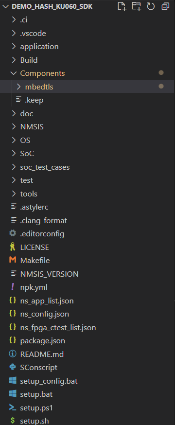

3. Setup Nuclei subsystem SDK to configure your toolchains and environment, you can refer to https://doc.nucleisys.com/nuclei_sdk/quickstart.html for details.

4. Build and run application.

   - Assume that you will run your application using bitstream, Nuclei N300 core and sram download mode.

   - cd *Components/mbedtls/examples/xxx*

   - configure `mbedtls_config.h` and `acc_xlcrypto_config.h`.

   - If you want to build your application, you can easily run this command:

     ```c
     make CORE=n300 DOWNLOAD=sram all
     ```

   - If you want to upload your application, you can easily run this command:

     ```c
     make CORE=n300 DOWNLOAD=sram upload
     ```

   - If you want to use UART terminal tool to view the application result, you can choose `screen` or `minicom` in Linux, `teraterm` in Windows, the default UART baudrate we use is `115200`. For example, test all HASH-related algorithm in *Components/mbedtls/examples/selftest* as follows:

      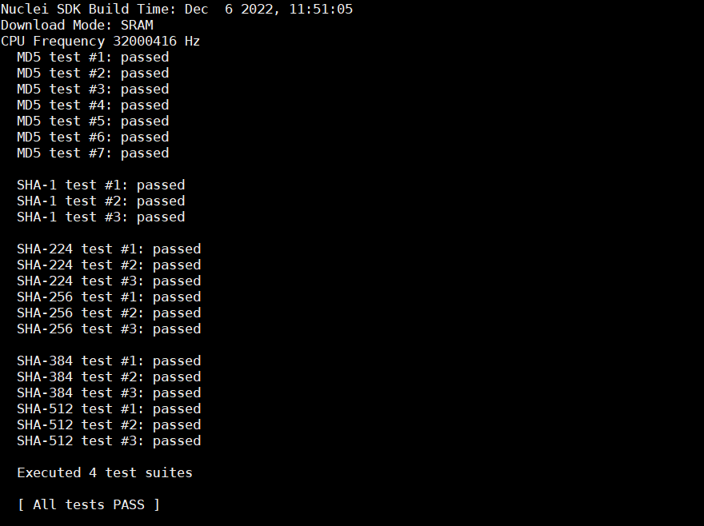

## How to use libmbedtls in Nuclei Studio IDE

1. Get Nuclei subsystem SDK, corresponding bitstream and board.

   - Assume that you will run your application using bitstream, Nuclei N300 core and sram download mode.

2. Download Nuclei Studio IDE from https://www.nucleisys.com/download.php, please refer to https://www.nucleisys.com/upload/files/doc/nucleistudio/Nuclei_Studio_User_Guide_202402.pdf to get the detailed usage of Nuclei Studio IDE.

3. Go to the Nuclei Package Management page to import the zip package of the subsystem SDK until the Status is installed, you need to make sure that only one version of NucleiSDK is installed.

   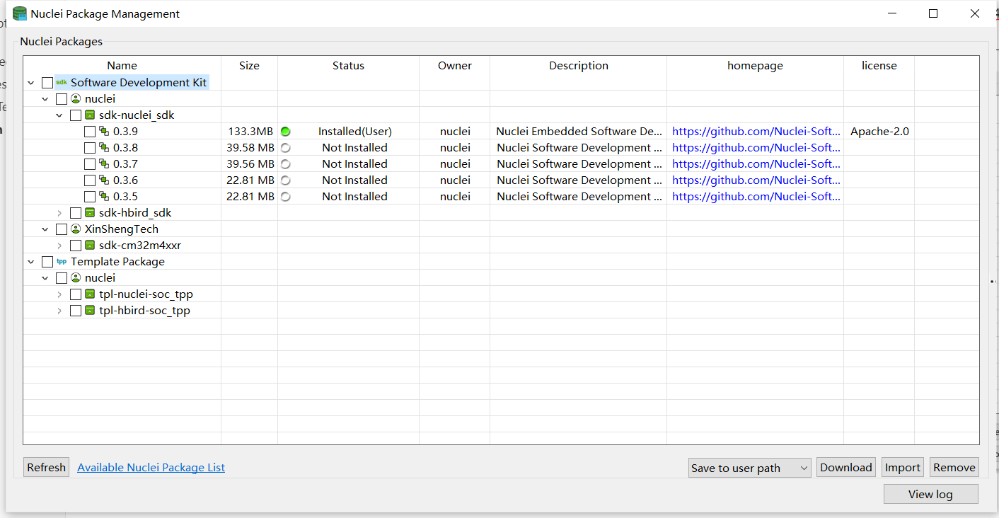

4. Import the zip package of **libmbedtls** until the Status is installed:

   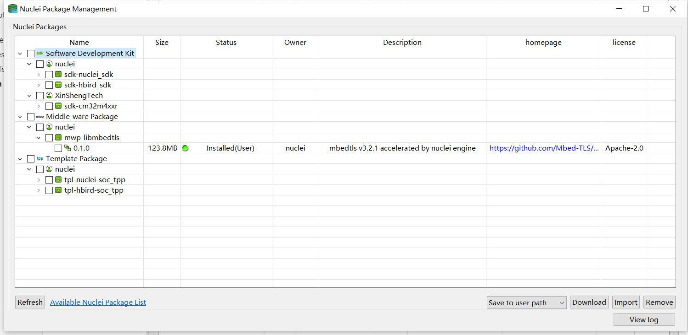

5. Create a new Nuclei RISC-V C/C++ Project.

   - Choose the SoC, board and SDK, you need to select the SDK corresponding to the SoC of the current subsystem.

      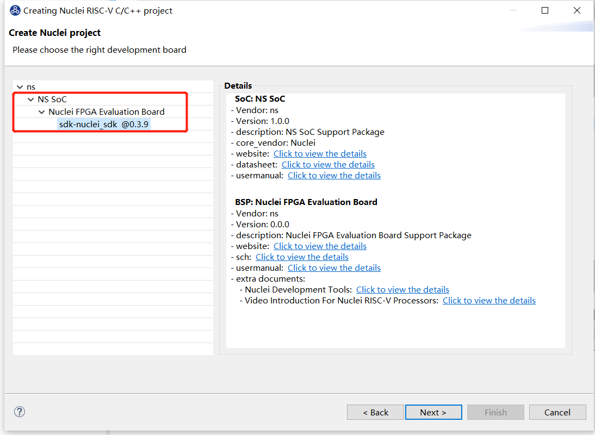

   - Use Filters to filter the keyword **mbedtls** to quickly find the example you want to run, and then set the configuration items and click Finish. For example, you want to run **selftest** in **sram download mode** with **newlib nano with printf float**, you should configure it as follows:

      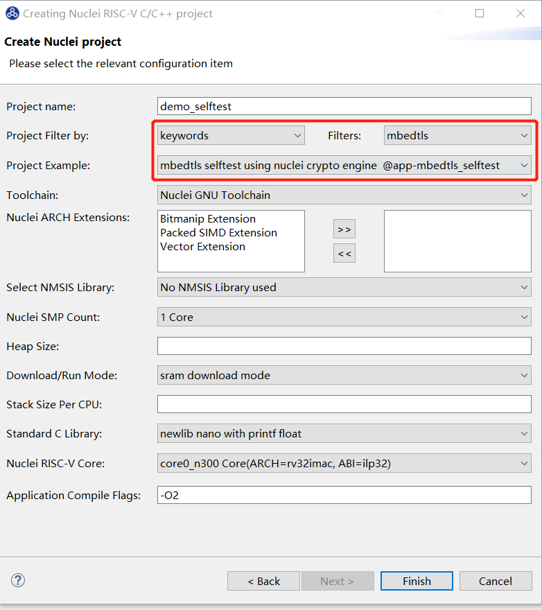

6. Build and run application.

   - If you want to build your application, you can easily click build icon:

      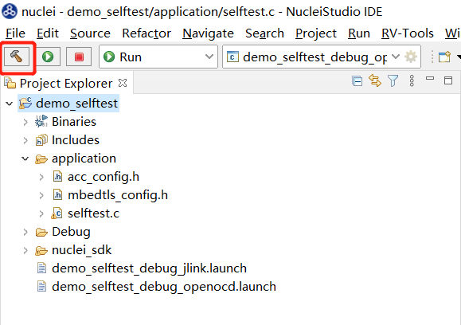

   - If you want to run your application, you can easily click run icon:

      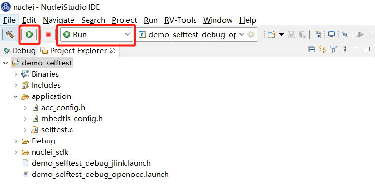

   - If you want to debug your application, you need to switch to debug mode:

      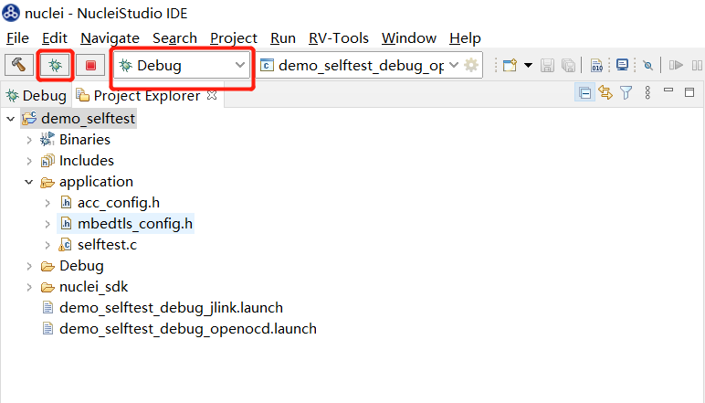

7. You can view the program running status in run mode or debug mode.

   - run mode: run until the end

      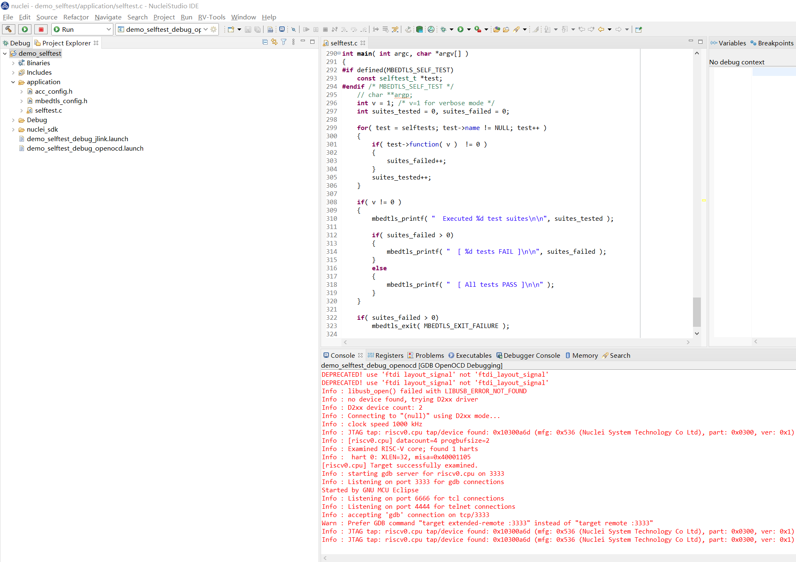

   - debug mode: you can run to the breakpoint for debugging and analysis

      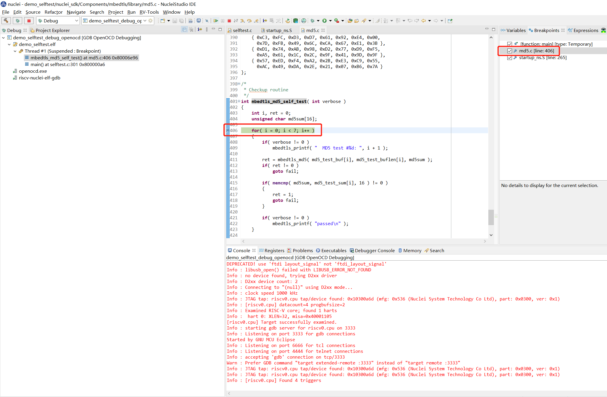

## Data performance

1. The data performance is obtained by running the benchmark example, please refer to `examples/benchmark/README.md` for specific test items.

2. Data performance is calculated based on the frequency of the CPU and the number of cycles consumed during the execution of the crypto algorithm.

   - HASH/CRYP: Using **KiB/s** and **cycles/byte** as the starndard for data performance.

   - ACRYP: Using **one public key algorithm/s** as the starndard for data performance. For example, the standard of RSA is used as **public/s** and **private/s**, the standard of ECDSA is used as **sign/s** and **verify/s**.

3. Assume that you will run your application using bitstream of **CPU frequency 30MHz**, Nuclei N300 core and ilm download mode. There are three test scenarios below:

   - Using HASH/CRYP engine accelerated in UDMA mode and ACRYP engine

   - Using HASH/CRYP engine accelerated in CPU mode and ACRYP engine

   - Using software implement (do not use any crypto engine)

    | Benchmark Algorithm   | HASH/CRYP/ACRYP engine (HASH/CRYP  accelerated in UDMA mode) | HASH/CRYP/ACRYP engine (HASH/CRYP  accelerated in CPU mode) | software implement            |
    | --------------------- | ------------------------------------------------------------ | ----------------------------------------------------------- | ----------------------------- |
    | MD5                   | 14562 KiB/s, 2 cycles/byte                                   | 2778 KiB/s, 10 cycles/byte                                  | 2109 KiB/s, 13 cycles/byte    |
    | SHA-1                 | 13464 KiB/s, 2 cycles/byte                                   | 2094 KiB/s, 13 cycles/byte                                  | 1283 KiB/s, 22 cycles/byte    |
    | SHA-256               | 13145 KiB/s, 2 cycles/byte                                   | 1988 KiB/s, 14 cycles/byte                                  | 575 KiB/s, 50 cycles/byte     |
    | SHA-512               | 10920 KiB/s, 2 cycles/byte                                   | 2117 KiB/s, 13 cycles/byte                                  | 275 KiB/s, 106 cycles/byte    |
    | SM3                   | 13315 KiB/s, 2 cycles/byte                                   | 1997 KiB/s, 14 cycles/byte                                  | 389 KiB/s, 75 cycles/byte     |
    | 3DES                  | 4058 KiB/s, 7 cycles/byte                                    | 1775 KiB/s, 16 cycles/byte                                  | 109 KiB/s, 268 cycles/byte    |
    | DES                   | 9832 KiB/s, 2 cycles/byte                                    | 2320 KiB/s, 12 cycles/byte                                  | 267 KiB/s, 109 cycles/byte    |
    | AES-CBC-128           | 13818 KiB/s, 2 cycles/byte                                   | 1873 KiB/s, 15 cycles/byte                                  | 406 KiB/s, 72 cycles/byte     |
    | AES-CBC-192           | 14690 KiB/s, 1 cycles/byte                                   | 1873 KiB/s, 15 cycles/byte                                  | 361 KiB/s, 81 cycles/byte     |
    | AES-CBC-256           | 14031 KiB/s, 2 cycles/byte                                   | 1873 KiB/s, 15 cycles/byte                                  | 325 KiB/s, 89 cycles/byte     |
    | AES-GCM-128           | 11385 KiB/s, 2 cycles/byte                                   | 2307 KiB/s, 12 cycles/byte                                  | 201 KiB/s, 145 cycles/byte    |
    | AES-GCM-192           | 11198 KiB/s, 2 cycles/byte                                   | 2308 KiB/s, 12 cycles/byte                                  | 189 KiB/s, 154 cycles/byte    |
    | AES-GCM-256           | 11160 KiB/s, 2 cycles/byte                                   | 2307 KiB/s, 12 cycles/byte                                  | 179 KiB/s, 163 cycles/byte    |
    | AES-CCM-128           | 9104 KiB/s, 3 cycles/byte                                    | 2315 KiB/s, 12 cycles/byte                                  | 189 KiB/s, 154 cycles/byte    |
    | AES-CCM-192           | 8441 KiB/s, 3 cycles/byte                                    | 2145 KiB/s, 13 cycles/byte                                  | 169 KiB/s, 172 cycles/byte    |
    | AES-CCM-256           | 7886 KiB/s, 3 cycles/byte                                    | 2145 KiB/s, 13 cycles/byte                                  | 153 KiB/s, 191 cycles/byte    |
    | RSA-2048              | 442  public/s                                                | 442  public/s                                               | 8  public/s                   |
    | RSA-2048              | 5 private/s                                                  | 5 private/s                                                 | 0 private/s                   |
    | RSA-4096              | 136  public/s                                                | 136  public/s                                               | 2  public/s                   |
    | RSA-4096              | 1 private/s                                                  | 1 private/s                                                 | 0 private/s                   |
    | ECDSA-secp521r1       | 12 sign/s                                                    | 11 sign/s                                                   | 1 sign/s                      |
    | ECDSA-brainpoolP512r1 | 12 sign/s                                                    | 12 sign/s                                                   | 0 sign/s                      |
    | ECDSA-secp384r1       | 23 sign/s                                                    | 23 sign/s                                                   | 2 sign/s                      |
    | ECDSA-brainpoolP384r1 | 23 sign/s                                                    | 23 sign/s                                                   | 0 sign/s                      |
    | ECDSA-secp256r1       | 52 sign/s                                                    | 52 sign/s                                                   | 5 sign/s                      |
    | ECDSA-secp256k1       | 51 sign/s                                                    | 50 sign/s                                                   | 4 sign/s                      |
    | ECDSA-brainpoolP256r1 | 50 sign/s                                                    | 50 sign/s                                                   | 0 sign/s                      |
    | ECDSA-secp224r1       | 58 sign/s                                                    | 58 sign/s                                                   | 6 sign/s                      |
    | ECDSA-secp224k1       | 64 sign/s                                                    | 63 sign/s                                                   | 4 sign/s                      |
    | ECDSA-secp192r1       | 82 sign/s                                                    | 81 sign/s                                                   | 8 sign/s                      |
    | ECDSA-secp192k1       | 81 sign/s                                                    | 80 sign/s                                                   | 6 sign/s                      |
    | ECDSA-secp521r1       | 5 verify/s                                                   | 5 verify/s                                                  | 0 verify/s                    |
    | ECDSA-brainpoolP512r1 | 6 verify/s                                                   | 6 verify/s                                                  | 0 verify/s                    |
    | ECDSA-secp384r1       | 11 verify/s                                                  | 12 verify/s                                                 | 0 verify/s                    |
    | ECDSA-brainpoolP384r1 | 11 verify/s                                                  | 12 verify/s                                                 | 0 verify/s                    |
    | ECDSA-secp256r1       | 28 verify/s                                                  | 28 verify/s                                                 | 1 verify/s                    |
    | ECDSA-secp256k1       | 26 verify/s                                                  | 26 verify/s                                                 | 1 verify/s                    |
    | ECDSA-brainpoolP256r1 | 26 verify/s                                                  | 26 verify/s                                                 | 0 verify/s                    |
    | ECDSA-secp224r1       | 31 verify/s                                                  | 31 verify/s                                                 | 2 verify/s                    |
    | ECDSA-secp224k1       | 36 verify/s                                                  | 36 verify/s                                                 | 1 verify/s                    |
    | ECDSA-secp192r1       | 46 verify/s                                                  | 46 verify/s                                                 | 2 verify/s                    |
    | ECDSA-secp192k1       | 44 verify/s                                                  | 44 verify/s                                                 | 1 verify/s                    |
    | ECDHE-secp521r1       | 3 full handshake/s                                           | 3 full handshake/s                                          | 0 full handshake/s            |
    | ECDHE-brainpoolP512r1 | 3 full handshake/s                                           | 3 full handshake/s                                          | 0 full handshake/s            |
    | ECDHE-secp384r1       | 6 full handshake/s                                           | 6 full handshake/s                                          | 0 full handshake/s            |
    | ECDHE-brainpoolP384r1 | 6 full handshake/s                                           | 6 full handshake/s                                          | 0 full handshake/s            |
    | ECDHE-secp256r1       | 15 full handshake/s                                          | 15 full handshake/s                                         | 0 full handshake/s            |
    | ECDHE-secp256k1       | 15 full handshake/s                                          | 15 full handshake/s                                         | 0 full handshake/s            |
    | ECDHE-brainpoolP256r1 | 15 full handshake/s                                          | 15 full handshake/s                                         | 0 full handshake/s            |
    | ECDHE-secp224r1       | 17 full handshake/s                                          | 17 full handshake/s                                         | 1 full handshake/s            |
    | ECDHE-secp224k1       | 21 full handshake/s                                          | 21 full handshake/s                                         | 0 full handshake/s            |
    | ECDHE-secp192r1       | 27 full handshake/s                                          | 27 full handshake/s                                         | 1 full handshake/s            |
    | ECDHE-secp192k1       | 27 full handshake/s                                          | 27 full handshake/s                                         | 0 full handshake/s            |
    | ECDHE-x25519          | 22 full handshake/s                                          | 22 full handshake/s                                         | 0 full handshake/s            |
    | ECDHE-x448            | 6 full handshake/s                                           | 6 full handshake/s                                          | 0 full handshake/s            |
